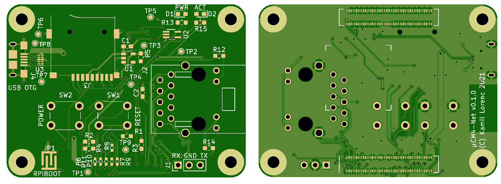

# uCM4

Raspberry Pi Compute Module 4 micro carrier board

# Features

* exactly same size as CM4
* support for both Lite and eMMC variants of CM4
* Gigabit Ethernet
* microSD slot (optional)
* Micro USB for power and USB 2.0 data transfer
* USB-OTG support

# Table of contents

1. [Customizations](customizations.md)
2. [Troubleshooting](troubleshooting.md)

# Project page

Complete project page with pictures, updates and so on, is available at
[Hackaday.io](https://hackaday.io/project/179793-ucm4).

# License

This work is licensed under a [Creative Commons Attribution 4.0 International License][cc-by].

You can use it for anything as long as you preserve license file and author information in source distribution and authorship information on PCB. Derived work should mention original author in same locations as this repository.

[![CC BY 4.0][cc-by-image]][cc-by]

[cc-by]: http://creativecommons.org/licenses/by/4.0/
[cc-by-image]: https://i.creativecommons.org/l/by/4.0/88x31.png
