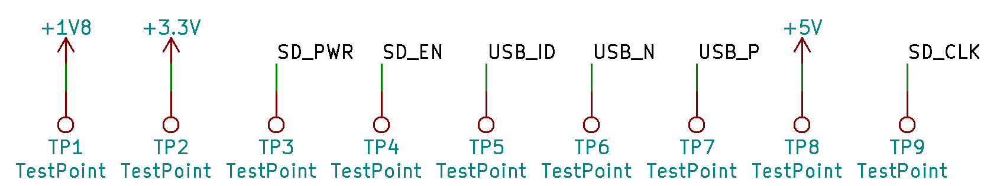

# Troubleshooting

## Basic troubleshooting with testpoints

For sake of troubleshooting the board, couple of testpoints were placed around the board. Above is a fragment of schematics of version 0.1.0 showing all TPs available in this version.

1. TP1 (+1V8) is rather obvious - should give 1.8 volts, once CM4 is connected and working.
2. TP2 (+3.3V) works the same way, but for 3.3 volts, supplied by CM4.
3. TP3 (SD_PWR) is the power given to SD connector with help of RT9742CGJ5F (see TP4 for input)
4. TP4 (SD_EN) is provided by CM4, once it decide to power SD card (if floating, powers card too!)
5. TP5 (USB_ID) is USB's ID pin for USB-OTG (broken on 0.1.0)
6. TP6 (USB_N) is USB D- signal (broken on 0.1.0)
7. TP7 (USB_P) is USB D+ signal (broken on 0.1.0)
8. TP8 (+5V) is 5 volts power supplied by USB connector (present always)
9. TP9 (SD_CLK) is clock of SD card connector, supplied by CM4. Transitional 400 kHz clock during early boot.
